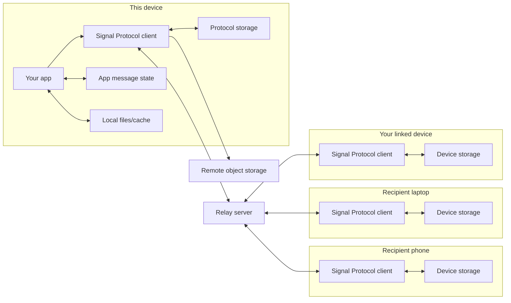

# Getting Started

> Navigation: [README](../README.md) | [ARCHITECTURE](../ARCHITECTURE.md) | **Getting Started**

This guide is for app developers who understand end-to-end encryption but do
not want to learn protocol internals before sending a message.

## Install

```bash
npm install @open-e2ee/signal-protocol-sdk
```

In this monorepo the package is consumed as a workspace package. App consumers
should also install any runtime dependencies their chosen adapters need, such as
Expo or Convex client packages.

## What You Need

Every client needs:

- a stable `userId` from your app,
- local `storage` for that user's encrypted protocol state,
- usually a `relay` for server sync and encrypted message delivery,
- remote encrypted object storage when sending attachments,
- device registration or provisioning with that relay for each active device.

The default security policy requires the package's post-quantum Signal Protocol
configuration. You do not need to configure protocol options for the normal
path.

This guide uses the current stable API names. The target message-first DX groups
local persistence under `deviceStorage.{protocol,messages,files}` and calls the
remote encrypted byte adapter `remoteObjectStore`. Current `signal.media.*`
examples are transition-only lower-level APIs; the target public API sends
message attachments through `signal.messages.send({ attachments })` and advanced
helpers, if needed, under a message-scoped API.

## Setup Sequence

For a production app, wire startup in this order:

1. Choose protocol storage for this device.
2. Create or configure the relay adapter.
3. Register or provision this device with the relay during app bootstrap.
4. Create the client with `createSignalProtocolClient()`.
5. Call `syncToServer()` so peers can discover this device's public prekeys.
6. Register receive hooks and start relay subscription delivery.

## Mental Model



- Each device owns its own app runtime, Signal Protocol client, protocol storage, message
  state, and local file/cache storage.
- The current `adapters.storage` API maps to the protocol facet of the target
  `deviceStorage` model.
- Your app owns decrypted message rows and local files after the Signal Protocol client
  decrypts or stages them.
- The relay connects devices, stores public keys, and carries encrypted
  envelopes.
- Remote object storage carries encrypted attachment/media bytes only.

## Target Message-First API Preview

This is the target DX the package is moving toward. It is shown here so app
developers can understand the intended mental model while the current stable API
still uses `storage`, `remoteObjectStore`, hooks, and transition-only media helpers.

<!-- mock-snippet:skip target-message-api-not-yet-shipped -->
```ts
// Real protocol and cryptography; simulated in-memory infrastructure.
import { createSignalProtocolClient } from "@open-e2ee/signal-protocol-sdk";
import { createInMemoryDeviceStorage } from "@open-e2ee/signal-protocol-sdk/device/storage/memory";
import { mockRelay } from "@open-e2ee/signal-protocol-sdk/remote/relay/mock";

const relay = mockRelay();

const alice = await createSignalProtocolClient({
  identity: { userId: "alice", deviceId: 1 },
  adapters: {
    deviceStorage: createInMemoryDeviceStorage(),
    relay,
  },
});

const bob = await createSignalProtocolClient({
  identity: { userId: "bob", deviceId: 1 },
  adapters: {
    deviceStorage: createInMemoryDeviceStorage(),
    relay,
  },
});

const delivered = new Promise<void>((resolve) => {
  bob.messages.subscribe(
    { conversationId: "dm:alice_bob" },
    async (message) => {
      console.log("bob decrypted:", message.text);
      resolve();
    },
  );
});

const plaintext = "hello from Alice";
console.log("alice plaintext input:", plaintext);

const sent = await alice.messages.send({
  conversationId: "dm:alice_bob",
  to: "bob",
  text: plaintext,
});

console.log("relay-visible encrypted envelope:", {
  envelopeId: sent.envelopeId,
  ciphertextLength: sent.ciphertextLength,
});

await delivered;
```

The production shape uses the same message API with platform adapters:

```ts
import { createSignalProtocolClient } from "@open-e2ee/signal-protocol-sdk";
import { createExpoDeviceStorage } from "@open-e2ee/signal-protocol-sdk/device/storage/expo";
import { convexR2ObjectStore } from "@open-e2ee/signal-protocol-sdk/remote/object-store/convex-r2";
import { convexRelay } from "@open-e2ee/signal-protocol-sdk/remote/relay/convex";
import { api } from "../convex/_generated/api";

const signal = await createSignalProtocolClient({
  identity: { userId, deviceId },
  adapters: {
    deviceStorage: createExpoDeviceStorage({ database, files }),
    relay: convexRelay({ convex, api, currentUserId: userId }),
    remoteObjectStore: convexR2ObjectStore({
      convex,
      api: api.signalObjectStore,
    }),
  },
});
```

Attachments use the same message API. On Expo, pass the picker URI; the Signal
Protocol client copies or persists the bytes through `deviceStorage.files`
before upload so retry can continue after restart:

```ts
await signal.messages.send({
  conversationId: "dm:alice_bob",
  to: "bob",
  text: "photo from Expo",
  attachments: [
    {
      source: pickedPhoto.uri,
      contentType: pickedPhoto.contentType,
      fileName: pickedPhoto.fileName,
      size: pickedPhoto.fileSize,
    },
  ],
});
```

On the web, pass the browser file object:

```ts
await signal.messages.send({
  conversationId,
  to: "bob",
  text: "photo from the browser",
  attachments: [
    {
      source: file,
      contentType: file.type,
      fileName: file.name,
      size: file.size,
    },
  ],
});
```

Once this API lands, this guide should teach the target path first and move the
current `signal.media.*` examples into lower-level transition or migration docs.

## Current Stable Local Clients

Use mock adapters for local examples and development:
the demo sends while Bob is offline, inspects the relay-visible ciphertext, and
then starts Bob's subscription to show the decrypted plaintext entering the app.

<!-- mock-snippet:run getting-started-stable-local-clients expect="bob decrypted: alice: hello" -->
```ts
// Real protocol and cryptography; simulated in-memory infrastructure.
import { createSignalProtocolClient } from "@open-e2ee/signal-protocol-sdk";
import { mockStore } from "@open-e2ee/signal-protocol-sdk/local/store/mock";
import { mockRelay } from "@open-e2ee/signal-protocol-sdk/remote/relay/mock";

const relay = mockRelay();

// The relay knows which devices exist, but it does not get plaintext.
await relay.registerDevice("alice", {
  encryptedDeviceName: new ArrayBuffer(0),
});
await relay.registerDevice("bob", { encryptedDeviceName: new ArrayBuffer(0) });

// Each client represents one device. Its protocol storage is local to that device.
const alice = await createSignalProtocolClient({
  identity: { userId: "alice" },
  adapters: { storage: mockStore(), relay },
});

const bob = await createSignalProtocolClient({
  identity: { userId: "bob" },
  adapters: { storage: mockStore(), relay },
});

await alice.syncToServer();
await bob.syncToServer();

// Send while Bob is offline so we can inspect what the relay stores.
const sent = await alice.send("bob", "hello");
console.log("alice sent:", sent.messageId);

// The relay-visible envelope contains metadata plus ciphertext, not plaintext.
const [queuedEnvelope] = relay.getPendingMessages("bob", 1);
const ciphertextLength =
  typeof queuedEnvelope.ciphertext === "string"
    ? queuedEnvelope.ciphertext.length
    : queuedEnvelope.ciphertext.byteLength;
const ciphertextPreview =
  typeof queuedEnvelope.ciphertext === "string"
    ? `${queuedEnvelope.ciphertext.slice(0, 32)}...`
    : `${queuedEnvelope.ciphertext.byteLength} encrypted bytes`;

console.log("relay sees encrypted envelope:", {
  messageType: queuedEnvelope.messageType,
  ciphertextLength,
  ciphertextPreview,
});

const decrypted = new Promise<void>((resolve) => {
  // Plaintext enters your app only after Bob's Signal Protocol client decrypts it.
  bob.registerHook("onMessageDecrypted", async (message) => {
    console.log("bob decrypted:", `${message.senderId}: ${message.content}`);
    resolve();
  });
});

// Starting the subscription delivers Bob's queued encrypted envelope.
bob.startRelaySubscription();
await decrypted;
```

Example output:

```text
alice sent: msg-1
relay sees encrypted envelope: {
  messageType: 'prekey_bundle',
  ciphertextLength: 3464,
  ciphertextPreview: '<base64 ciphertext preview>...'
}
bob decrypted: alice: hello
```

The mock relay lets the example inspect what a server can see. The relay sees
metadata plus encrypted envelope bytes; it does not receive Bob's decrypted
message content. The first message often uses `prekey_bundle` to establish a
session, and later messages use `ciphertext`.

## Production Client

Use the protocol storage adapter for your runtime and the relay adapter for your
backend. For the Signal Protocol stack, that is Expo local storage and a Convex
relay:

```ts
import { createSignalProtocolClient } from "@open-e2ee/signal-protocol-sdk";
import { expoStore } from "@open-e2ee/signal-protocol-sdk/local/store/expo";
import {
  convexRelay,
  type ConvexSignalProtocolRelayApi,
} from "@open-e2ee/signal-protocol-sdk/remote/relay/convex";
import { api } from "../convex/_generated/api";

const signalApi = api.signal satisfies ConvexSignalProtocolRelayApi;

// The relay handles server-side public keys, devices, and encrypted envelopes.
const relay = convexRelay({
  convex,
  api: signalApi,
  currentUserId: userId,
});

const signal = await createSignalProtocolClient({
  identity: { userId },
  adapters: {
    // Storage owns this device's private keys and session state.
    storage: expoStore(),
    relay,
  },
});

// Publish this device's public prekeys so other devices can start sessions.
await signal.syncToServer();
```

Production bootstrapping must register or provision the current device with the
relay before user-level sends can discover it. Device registration and
provisioning belong to the application bootstrap.

## Receive Messages

Register a receive hook before starting the relay subscription:

```ts
signal.registerHook("onMessageDecrypted", async (message) => {
  // Decrypted content belongs in your app database, not in the relay.
  await appMessages.insert({
    messageId: message.messageId,
    conversationId: message.conversationId,
    senderId: message.senderId,
    senderDeviceId: message.senderDeviceId,
    body: message.content,
    receivedAt: message.receivedAt,
  });
});

// Subscribing starts encrypted envelope delivery and local decryption.
signal.startRelaySubscription();
```

The package does not own your product database or UI state. It decrypts messages
and hands the app a `DecryptedEnvelope`.

## Send Messages

Send by recipient user ID for normal one-to-one and multi-device delivery:

```ts
await signal.send("bob", "hello");
```

For structured app messages, pass an object:

```ts
await signal.send("bob", {
  body: "hello",
  conversationId: "dm:alice_bob",
  timestamp: Date.now(),
});
```

## Attachments

Add a remote object store when your app sends encrypted attachments. The
`remoteObjectStore` adapter brokers encrypted byte objects rather than
plaintext files.
The final public DX should not expose both `signal.media.*` and message
attachment helpers; the planned replacement is message-scoped attachment
handling.

```ts
import { media } from "@open-e2ee/signal-protocol-sdk";
import { convexR2ObjectStore } from "@open-e2ee/signal-protocol-sdk/remote/object-store/convex-r2";
import { api } from "../convex/_generated/api";

const signal = await createSignalProtocolClient({
  identity: { userId },
  adapters: {
    storage,
    relay,
    remoteObjectStore: convexR2ObjectStore({
      convex,
      api: api.signalObjectStore,
    }),
  },
  media: {
    loadLocalAttachment: async ({ localMediaId }) =>
      appDraftMedia.readBytes(localMediaId),
    saveUploadedAttachment: async ({ localMediaId, attachment }) =>
      appMediaPointers.save(localMediaId, attachment),
    saveDownloadedAttachment: async ({ attachmentId, downloaded }) =>
      appMediaCache.save(attachmentId, downloaded.data),
    deleteLocalAttachment: async ({ attachmentId }) =>
      appMediaCache.delete(attachmentId),
  },
});
```

For Amazon S3 or S3-compatible storage, use the framework-neutral adapter with
an authenticated application-backend broker:

```ts
import { s3ObjectStore } from "@open-e2ee/signal-protocol-sdk/remote/object-store/s3";

const remoteObjectStore = s3ObjectStore({
  broker: {
    createUpload: (input) => storageApi.createS3Upload(input),
    createDownload: (input) => storageApi.createS3Download(input),
    completeUpload: (input) => storageApi.completeS3Upload(input),
    deleteObject: (input) => storageApi.deleteS3Object(input),
  },
});
```

Keep AWS credentials and AWS SDK clients on that backend. The app should
receive only narrowly scoped, short-lived upload, download, and delete
operations.

Send bytes when the attachment should be delivered as its own encrypted
message:

```ts
const controller = new AbortController();

await signal.send("bob", photoBytes, {
  isBinary: true,
  mimeType: "image/jpeg",
  fileName: "photo.jpg",
  width: 1200,
  height: 800,
  thumbnail: thumbnailBase64,
  attachment: {
    transfer: media.createTusMediaAttachmentTransfer({
      chunkSizeBytes: 1024 * 1024,
    }),
    signal: controller.signal,
    policy: media.MEDIA_ATTACHMENT_POLICY_PRESETS.Image,
    onProgress: (event) => {
      console.log(
        event.operation,
        event.phase,
        event.bytesTransferred,
        event.totalBytes,
      );
    },
  },
});
```

Upload first when your app message format embeds the attachment pointer inside a
larger payload:

```ts
const attachment = await signal.uploadAttachment(photoBytes, {
  mimeType: "image/jpeg",
  fileName: "photo.jpg",
  width: 1200,
  height: 800,
  thumbnail: thumbnailBase64,
  attachment: {
    transfer: media.createTusMediaAttachmentTransfer({
      chunkSizeBytes: 1024 * 1024,
    }),
    policy: media.MEDIA_ATTACHMENT_POLICY_PRESETS.Image,
  },
});

await signal.send("bob", {
  body: "trip photo",
  attachments: [attachment],
  timestamp: Date.now(),
});
```

Progress callbacks include `retry` events with `reason`, `status`, and
`retryInMs` so product code can distinguish an expired upload/download URL from
a generic transient failure.

`attachment.transfer` is where production apps plug in their foreground or
background transfer adapter. The Signal Protocol client still owns encryption, digest
verification, retries, and pointer metadata; the adapter owns how bytes move
over the network.

If your object store returns TUS credentials, including `protocol: 'tus'`, the
client uses the built-in TUS transfer helper
automatically. Passing `media.createTusMediaAttachmentTransfer()` explicitly is
useful when the app needs custom chunk sizing or a platform-specific `fetch`.

For downloads in JavaScript runtimes, `media.createByteRangeMediaAttachmentTransfer()`
provides a reviewed HTTP `Range` adapter. It validates `Content-Range`, forwards
signed download headers from the object store, emits checkpoints, and only resumes
from a non-zero offset when your app provides the partial ciphertext prefix via a
partial-byte store. Native background download code should implement the same
`MediaAttachmentTransfer` interface.

For background-safe uploads, use the durable client operation. The current API
persists bounded recovery metadata through the existing Signal Protocol storage
adapter; the target message-first API moves that responsibility behind
`deviceStorage.messages`. The operation tries the upload when it is due and
returns either a completed pointer or a pending job id for later recovery:

```ts
const upload = await signal.media.upload(
  {
    localMediaId: draftMedia.id,
    contentType: draftMedia.contentType,
    size: draftMedia.byteLength,
    policy: media.MEDIA_ATTACHMENT_POLICY_PRESETS.Video,
  },
  {
    transfer: media.createTusMediaAttachmentTransfer({
      chunkSizeBytes: 1024 * 1024,
    }),
    onCheckpoint: appMediaTransfers.save,
  },
);

if (upload.status === "completed") {
  await appComposer.attach(upload.attachment);
}
```

Run pending durable media work on app startup, foreground resume, or from a
background task:

```ts
await signal.media.processPending({
  limit: 10,
  transfer: appMediaTransferAdapter,
  onCheckpoint: appMediaTransfers.save,
});
```

On receive, ask the media planner what work this device should do. Your app
supplies the IDs it has already processed or cached; the Signal Protocol package
returns the safe next step without taking ownership of your app database:

```ts
const mediaWork = media.planMediaAttachmentProcessing({
  attachment,
  senderUserId,
  timestamp: messageTimestamp,
  processedDeliveryIds: await appMessages.processedMediaDeliveryIds(),
  cachedAttachmentIds: await appMediaCache.attachmentIds(),
  openedViewOnceDeliveryIds: await appMediaCache.openedViewOnceDeliveryIds(),
});

if (mediaWork.shouldPersistMessage) {
  await appMessages.insert(message);
}

if (mediaWork.cleanup?.deleteLocalCache) {
  await appMediaCache.delete(mediaWork.cleanup.storageId);
}

if (mediaWork.downloadJob) {
  await signal.media.download(
    {
      attachment,
      senderUserId,
      timestamp: messageTimestamp,
      processedDeliveryIds: await appMessages.processedMediaDeliveryIds(),
      cachedAttachmentIds: await appMediaCache.attachmentIds(),
      openedViewOnceDeliveryIds:
        await appMediaCache.openedViewOnceDeliveryIds(),
    },
    {
      transfer: media.createByteRangeMediaAttachmentTransfer({
        chunkSizeBytes: 1024 * 1024,
        partialStore: appMediaTransfers.partialStore(),
      }),
    },
  );
}
```

If the planner says this device needs media bytes, pass the decrypted attachment
pointer back to the client. The client downloads encrypted blob bytes, verifies
the digest, authenticates the stream, and returns plaintext bytes:

```ts
if (mediaWork.shouldDownload) {
  const downloaded = await signal.downloadAttachment(attachment, {
    transfer: media.createByteRangeMediaAttachmentTransfer({
      chunkSizeBytes: 1024 * 1024,
      partialStore: appMediaTransfers.partialStore(),
    }),
    policy: media.MEDIA_ATTACHMENT_POLICY_PRESETS.Image,
    resume: await appMediaTransfers.resumeState(mediaWork.attachmentId),
    onCheckpoint: (checkpoint) => appMediaTransfers.save(checkpoint),
    onProgress: (event) => {
      console.log(
        event.operation,
        event.phase,
        event.bytesTransferred,
        event.totalBytes,
      );
    },
  });

  await appMediaCache.put(mediaWork.attachmentId, downloaded.data);

  console.log(downloaded.contentType);
  console.log(downloaded.data.byteLength);
  console.log(downloaded.width, downloaded.height, downloaded.thumbnail);
}
```

If the attachment is view-once, plan the local cleanup and linked-device sync
after the user opens it:

```ts
const opened = media.planMediaAttachmentOpen({
  attachment,
  senderUserId,
  timestamp: messageTimestamp,
});

if (opened.viewOnceOpenSync) {
  await signal.syncViewOnceOpenToLinkedDevices(opened.viewOnceOpenSync);
}

if (opened.cleanup?.deleteLocalCache) {
  await appMediaCache.delete(opened.cleanup.storageId);
}

if (opened.cleanup?.deleteRemoteBlob) {
  await signal.deleteRemoteAttachment(attachment);
}
```

When a message delete or expiration should remove media on this account's linked
devices, plan and sync the deletion after your app applies the local cleanup:

```ts
const deleteSync = media.planMediaAttachmentDeleteSync({
  attachment,
  reason: media.MediaAttachmentCleanupReason.MessageDeleted,
  deletedAt: Date.now(),
});

await appMediaCache.delete(deleteSync.storageId);
await signal.syncMediaAttachmentDeleteToLinkedDevices(deleteSync);
```

When cleanup should be performed by a worker, use the durable client operation:

```ts
await signal.media.cleanup(
  {
    cleanup: media.planMediaAttachmentCleanup(
      attachment,
      media.MediaAttachmentCleanupReason.MessageExpired,
    ),
    includeLocal: true,
    includeRemote: true,
    includeSync: true,
  },
  {
    transfer: appMediaTransferAdapter,
  },
);
```

## Security Policy

The default is:

```ts
protocol: {
  postQuantum: 'required',
  braid: 'required',
}
```

Leave it unset unless your product has a specific compatibility decision. See
[Protocol Policy](./PROTOCOL_POLICY.md) for the rare cases where you would set
`postQuantum: 'compatible'` or `braid: 'disabled'`.

## Where To Go Next

- [Client Composition](./CLIENT_COMPOSITION.md): app setup and adapter shape.
- [Protocol Policy](./PROTOCOL_POLICY.md): security policy choices.
- [Adapters](../ADAPTERS.md): implementing current custom storage, relay, or blob
  stores before the target `deviceStorage` and `remoteObjectStore` API lands.
- [API Reference](./api/README.md): generated TypeScript API docs.
